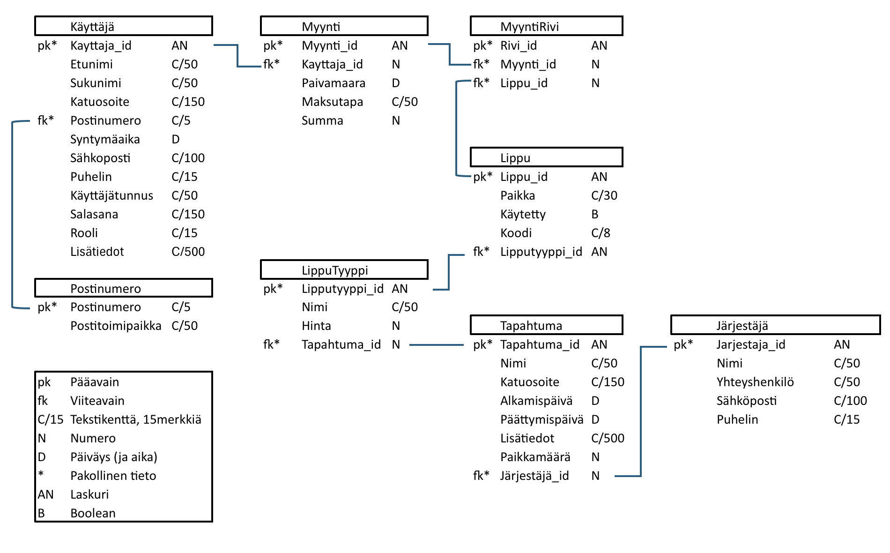

# TicketGuru-projekti

Tämä projekti on tehty osana Haaga-Helian Ohjelmistoprojekti 1 - SOF005AS3A-3021 kurssia (syksy 2025).

Projektin jäsenet (scrum-tiimi):

* Jari Kuusikko
* Anton Mattila
* Markus Ovaska
* Samuel Fizum Semere
* Timo Veijalainen

Kurssitoteutuksen vetäjät (tuotteenomistajat):

* Petteri Lappalainen
* Markku Ruonavaara

## Johdanto

Projektin aiheena on luoda järjestelmä TicketGuru lipunmyyntipalvelulle. Asiakkaana on lipputoimisto, TicketGurun omistaja. Järjestelmältä halutaan mahdollisuus lipunmyyntiin, tapahtumien järjestelyyn, lippujen tulostamiseen, ja lippuihin koodit jotka kuitataan tapahtuman ovella.

 Järjestelmä toteutetaan Spring Boot ympäristössä.

Lähtökohtaisesti järjestelmä pyritään saada toimimaaan kaikilla päätelaitetyypeillä. Jatkokehityksessä on tarkoituksena luoda myös verkkokauppa lipunostoa varten.

## Järjestelmän määrittely

## Käyttäjäroolit:

### Asiakas

Epäsuorasti käyttää järjestelmää. Pyytää lipunmyyjältä lipun/liput tiettyyn tapahtumaan ja maksaa ne.

### Lipunmyyjä

Lipunmyyjä myy asiakkaan valitsemalle tapahtumalle lipun/liput ja tulostaa tarvittaessa ne. Lipunmyyjä pystyy tarkastelemaan tapahtumia ja tekemään myyntitoimintoja.

### Lipuntarkastaja

Lipuntarkastaja tarkastaa lipun aitouden ja merkitsee lipun käytetksi, jotta yhtä lippua voi käyttää vain kerran.

### Järjestelmän ylläpitäjä

Pitää huolen siitä, että järjestelmä toimii oikein. Pystyy lisäämään, muokkaamaan ja poistamaan tapahtumia. Pystyy myös tekemään saman myynnin suhteen.

### Järjestäjä

Epäsuorasti käyttää järjestelmää. Ilmoittaa järjestelmän ylläpitäjälle tapahtuman tiedot, lipputyypit ja hinnat. 

## Käyttötapaus

## Käyttäjätarinat

### Tarina1

Lipunmyyjä haluaa pystyä myymään ja tulostamaan useita lippuja yhdelle asiakkaalle, jotta myyminen olisi tehokkaampaa.

### Tarina 2

Asiakas haluaa, että hän pääsee lippunsa kanssa takuuvarmasti tapahtumaan.

### Tarina 3

Lipuntarkastaja haluaisi, että liput voidaan lukea lukulaitteella. Näin ei tarvitse pitää lippulistoja, joita yliviivamalla merkataan käytetyt liput.

### Tarina 4

Järjestelmän ylläpitäjä haluaa kyetä jatkokehittämään järjestelmään, vaikka tämä olisi käytössä.

### Tarina 5

Lipunmyyjä haluaa tulostaa myymättömät liput ovelle kerralla ilman suurempaa päänvaivaa.

### Tarina 6

Lipunmyyjä haluaa pystyä valita lipun tyypin. Aikuinen, lapsi tai erityisryhmä.

### Tarina 7

Järjestelmän ylläpitäjä haluaa pystyä määrittämään uusia lipputyyppejä.

### Tarina 8

Asiakas haluaa voida ostaa lippunsa myös sähköisenä (esim. mobiililippuna), jotta hänen ei tarvitse kantaa paperilippua mukanaan.

### Tarina 9

Lipuntarkastaja haluaa, että järjestelmä ilmoittaa heti jos lippu on jo käytetty, jotta väärinkäytökset voidaan estää nopeasti.

### Tarina 10

Asiakas haluaa voida tarkastella tapahtumia ja niiden tietoja.

### Tarina 11

Lipunmyyjä haluaa pystyä myymään lippuja asiakkaalle myyntipisteessä

## Käyttöliittymä

## Tietokanta

### Järjestäjä
Järjestäjä-taulu sisältää tapahtumien järjestäjät

| Kenttä        | Tyyppi           | Kuvaus                     |
| ------------- | ---------------- | -------------------------- |
| jarjestaja_id | Long, PK         | Järjestäjän tunniste       |
| nimi          | String, NOT NULL | Järjestäjän nimi           |
| yhteyshenkilo | String           | Järjestäjän yhteyshenkilö  |
| sahkoposti    | String, NOT NULL | Järjestäjän sähköposti     |
| puhelin       | String           | Järjestäjän puhelinnumero  |

### Käyttäjä
Käyttäjä-taulu sisältää käyttäjän tiedot

| Kenttä       | Tyyppi                   | Kuvaus                          |
| ------------ | ------------------------ | ------------------------------- |
| kayttaja_id  | Long, PK                 | Käyttäjän yksilöllinen tunniste |
| etunimi      | String, NOT NULL         | Käyttäjän etunimi               |
| sukunimi     | String, NOT NULL         | Käyttäjän sukunimi              |
| katuosoite   | String, NOT NULL         | Käyttäjän katuosoite            |
| syntymaaika  | LocalDate, NOT NULL      | Käyttäjän syntymäaika           |
| sahkoposti   | String, NOT NULL         | Käyttäjän sähköpostiosoite      |
| puhelinnro   | String                   | Käyttäjän puhelinnumero         |
| lisatieto    | String                   | Muut lisätiedot                 |
| postinumero  | String                   | Viittaus Postinumero-tauluun    |
| username     | String, NOT NULL, UNIQUE | Käyttäjän tunnus järjestelmään  |
| passwordHash | String, NOT NULL         | Käyttäjän salasana (kryptattu)  |
| rooli        | String, NOT NULL         | Käyttäjän rooli (USER / ADMIN)  |

### Lippu
Lippu-taulu sisältää liput tapahtumiin

| Kenttä        | Tyyppi            | Kuvaus                            |
| ------------- | ----------------- | --------------------------------- |
| lippu_id      | Long PK, NOT NULL | Lipun tunniste                    |
| lipputyyppi   | Long FK, NOT NULL | Viittaus LippuTyyppi-tauluun      |
| paikka        | String            | Lipun paikka                      |
| kaytetty      | Boolean, NOT NULL | Lipun tila (käytetty/käyttämätön) |
| koodi         | String, NOT NULL  | Lipun koodi                       |

### LippuTyyppi
LippuTyyppi-taulu sisältää tapahtumien erilaiset lipputyypit

| Kenttä      | Tyyppi            | Kuvaus                     |
| ----------- | ----------------- | -------------------------- |
| tyyppi_id   | Long PK, NOT NULL | Lipputyypin tunniste       |
| nimi        | String, NOT NULL  | Lipputyypin nimi           |
| hinta       | Double            | Lipputyypin hinta          |
| tapahtumaId | Long FK, NOT NULL | Viittaus Tapahtuma-tauluun |

### Myynti
Myynti-taulu sisältää asiakkaan tekemät ostotiedot

| Kenttä      | Tyyppi              | Kuvaus                      |
| ----------- | ------------------- | --------------------------- |
| myyntiId    | Long PK, NOT NULL   | Myynnin tunniste            |
| kayttaja_id | Long FK, NOT NULL   | Viittaus Kayttaja-tauluun   |
| paivamaara  | LocalDate, NOT NULL | Myynnin päivämäärä          |
| maksutapa   | String, NOT NULL    | Maksutapa                   |
| summa       | Double              | Myynnin summa               |

### Myyntirivi
Myyntirivi-taulu sisältää yksittäiset myynnit

| Kenttä    | Tyyppi            | Kuvaus                  |
| ----------| ----------------- | ----------------------- |
| rivi_id   | Long PK, NOT NULL | Myyntirivin tunniste    |
| myyntiId  | Long FK, NOT NULL | Viittaus Myynti-tauluun |
| lippu_id  | Long FK, NOT NULL | Viittaus Lippu-tauluun  |

### Postinumero
Postinumero-taulu sisältää postinumeron tiedot

| Kenttä           | Tyyppi              | Kuvaus                    |
| ---------------- | ------------------- | ------------------------- |
| postinumero      | String PK, NOT NULL | Postinumero               |
| postitoimipaikka | String, NOT NULL    | Postitoimipaikan nimi     |

### Tapahtuma
Tapahtuma-taulu sisältää tapahtumatiedot

| Kenttä        | Tyyppi            | Kuvaus                         |
| ------------- | ----------------- | ------------------------------ |
| tapahtumaId   | Long PK, NOT NULL | Tapahtuman tunniste            |
| nimi          | String, NOT NULL  | Tapahtuman nimi                |
| katuosoite    | String, NOT NULL  | Tapahtuman katuosoite          |
| alkamisPvm    | Date, NOT NULL    | Tapahtuman alkamispäivämäärä   |
| paattymisPvm  | Date, NOT NULL    | Tapahtuman päättymispäivämäärä |
| lisatiedot    | String            | Muut lisätiedot                |
| paikkamaara   | Long, NOT NULL    | Tapahtuman paikkamäärä         |
| jarjestaja_id | Long FK, NOT NULL | Viittaus Järjestäjä-tauluun    |

## API-dokumentaatio

API-dokumentaatio löytyy toisesta tiedostosta, jonka pääsee lukemaan [tästä](API-Dokumentaatio.md).

## Tekninen kuvaus

Spring Bootilla toteutettu sovellus, jossa käytetään RESTia backendin ja frontendin kommunikoinnissa. Frontend toimii erillisenä React-projektina. React kommunikoi RESTin kanssa ja tallentaa tapahtumat MySQL. 
#### Käytetyt teknologiat:
- Maven 4.0.0 
- Java 17
- Spring Boot 3.5.5
- React 19.2.0
- MySQL 8.0.17
- h2

React toimii käyttäjän selaimessa, eli näyttää myyntinäkymän ja tekee REST-kutsuja.
REST vastaanottaa pyynnöt ja syöttäää ne Service-kerrokselle.
Service-kerros tarkastaa käyttäjän, varaa lipun ja hoitaa myyntitapahtuman.
Model ja Repository- kerrokset hallitsevat tietokantaa CRUD toiminnoilla olioille. 
Security-kerros autentikoi, auktorisoi ja valvoo CORS-säännöksiä. 
Tietokanta-kerros tallentaa kaikki tiedot. 

#### Järjestely:
- Model: Entiteetit
- Service: Toiminnot
- Controller: REST-kontrollerit
- SecurityConfig: autentikaatio ja auktorisaatio

## Testaus

Ohjelmaa testataan yksikkö, integraatio ja E2E testeillä. Testejä luodaan tuotetta kehittäessä/heti kun sitä voi testata. Testausta suoritetaan myös manuaalisesti.
Testien tavoite on varmentaa ohjelman tai sen osien toiminta, sekä löytää virheet.
Testaukseen käytettävät teknologiat: JUnit, Mockito, Spring Data JPA, Spring Boot Test, MockMvc.

linkistä tarkemmat tiedot: [TestiDomumentti](TestiDokumentti.md)

## Asennustiedot

Ensiksi kloonaa projekti

Backend osoitteesta: https://github.com/veitim/ohjelmistoprojekti_ryhma.git

Frontend osoitteesta: https://github.com/SamuelFizumSemere/Ticket-Frontend.git

### Järjestelmän kehitysympäristö - Backend

- Vaatimukset:
 - Maven 4.0.0 
 - Java 17
 - Spring Boot 3.5.5
 - h2

* application-dev.properties säädöt h2 tietokantaa varten.
 
       spring.application.name=ticketguru
       spring.datasource.url=jdbc:h2:mem:testdb
       spring.datasource.driverClassName=org.h2.Driver
       spring.datasource.username=sa
       spring.datasource.password=
       spring.h2.console.enabled=true
       spring.h2.console.path=/h2-console
       spring.jpa.database-platform=org.hibernate.dialect.H2Dialect
       spring.jpa.hibernate.ddl-auto=update
       spring.data.rest.base-path=/api

* Kehitysympäristöä varten ohjelmiston "application.properties" tiedostosta pitaa olla aktiivsena "spring.profiles.active=dev"

      spring.profiles.active=dev
      spring.data.rest.base-path=/api

### Järjestelmän tuotantoympäristö - Backend

- Vaatimukset:
 - Maven 4.0.0 
 - Java 17
 - Spring Boot 3.5.5
 - MySQL 8.0.17

* application-prod.properties säädöt mySql tietokantaa varten.
  
      spring.datasource.url=jdbc:mysql://${MYSQL_SERVICE_HOST}:${MYSQL_SERVICE_PORT}/${DB_NAME}
      spring.datasource.username=${DB_USER}
      spring.datasource.password=${DB_PASSWORD}
      spring.jpa.show-sql=true
      spring.jpa.generate-ddl=true
      spring.jpa.hibernate.ddl-auto=update
      spring.data.rest.base-path=/api

* Tuotantoympäristöä varten ohjelmiston "application.properties" tiedostosta pitaa olla aktiivsena "spring.profiles.active=prod"

      spring.profiles.active=prod
      spring.data.rest.base-path=/api

Jos sovellusta halutaan ajaa uudessa tuotantoympäristössä, niin seuraavalla dockerfilellä voi tehdä sovelluksesta käytettävän version.
Sovelluksen dockerfile:
  
    FROM eclipse-temurin:17-jdk-focal as builder
    WORKDIR /opt/app
    COPY .mvn/ .mvn
    COPY mvnw pom.xml ./
    RUN chmod +x ./mvnw
    RUN ./mvnw dependency:go-offline
    COPY ./src ./src
    RUN ./mvnw clean install -DskipTests
    RUN find ./target -type f -name '*.jar' -exec cp {} /opt/app/app.jar \; -quit
    
    FROM eclipse-temurin:17-jre-alpine
    COPY --from=builder /opt/app/*.jar /opt/app/
    EXPOSE 8080
    ENTRYPOINT ["java", "-jar", "/opt/app/app.jar"]

* Tätä tarvitaan, kun halutaan tehdä ajettava versio ohjelmasta.

* Ympäristö tarvitseem myös 

### Järjestelmän Frontend

Kloonaa frontend osoitteesta: https://github.com/SamuelFizumSemere/Ticket-Frontend.git

* Asenna vaaditut kirjastot komennolla:

      npm install

* Käynnistä sovellus komennolla:

      npm run dev

* Sovellus käynnistyy osoitteeseen:

      http://localhost:5174/

* Tai:

      http://localhost:5173/

* Frontendi tekee pyynnöt rahtipalvelussa olevaan sovellukseen.
* Jos halutaan kehitysympäristöön, pitää koodista käytdä muuttamassa api-kutsujen osoitteet vastaamaan lokaalia osoitetta (oletuksena "localhost:8080"). 

## Käynnistys- ja käyttöohje

Kun frontend on asennettuna, niin,

### Frontend: Kirjautumistiedot:

* Käyttäjä: "admin" Salasana: "admin" = admin oikeudet
* Käyttäjä: "user" Salasana: "user" = user oikeudet

Sovelluksen backend löytyy seuraavasta osoitteesta: https://ticketguru-git-ticketguru.2.rahtiapp.fi/

### Backend: Kirjautumistiedot:

* Käyttäjä: "admin" Salasana: "admin" = admin oikeudet
* Käyttäjä: "user" Salasana: "user" = user oikeudet
