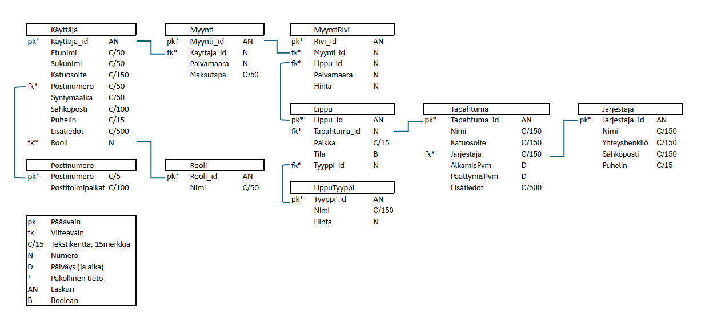

# TicketGuru-projekti

Tämä projekti on tehty osana Haaga-Helian Ohjelmistoprojekti 1 - SOF005AS3A-3021 kurssia (syksy 2025).

Projektin jäsenet (scrum-tiimi):

* Jari Kuusikko
* Anton Mattila
* Markus Ovaska
* Samuel Fizum Semere
* Timo Veijalainen

Kurssitoteutuksen vetäjät (tuotteenomistajat):

* Petteri Lappalainen
* Markku Ruonavaara

## Johdanto

Projektin aiheena on luoda järjestelmä TicketGuru lipunmyyntipalvelulle. Asiakkaana on lipputoimisto, TicketGurun omistaja. Järjestelmältä halutaan mahdollisuus lipunmyyntiin, tapahtumien järjestelyyn, lippujen tulostamiseen, ja lippuihin koodit jotka kuitataan tapahtuman ovella.

 Järjestelmä toteutetaan Spring Boot ympäristössä.

Lähtökohtaisesti järjestelmä pyritään saada toimimaaan kaikilla päätelaitetyypeillä. Jatkokehityksessä on tarkoituksena luoda myös verkkokauppa lipunostoa varten.

## Järjestelmän määrittely

## Käyttäjäroolit:

### Asiakas

Epäsuorasti käyttää järjestelmää. Pyytää lipunmyyjältä lipun/liput tiettyyn tapahtumaan ja maksaa ne.

### Lipunmyyjä

Lipunmyyjä myy asiakkaan valitsemalle tapahtumalle lipun/liput ja tulostaa tarvittaessa ne. Lipunmyyjä pystyy tarkastelemaan tapahtumia ja tekemään myyntitoimintoja.

### Lipuntarkastaja

Lipuntarkastaja tarkastaa lipun aitouden ja merkitsee lipun käytetksi, jotta yhtä lippua voi käyttää vain kerran.

### Järjestelmän ylläpitäjä

Pitää huolen siitä, että järjestelmä toimii oikein. Pystyy lisäämään, muokkaamaan ja poistamaan tapahtumia. Pystyy myös tekemään saman myynnin suhteen.

### Järjestäjä

Epäsuorasti käyttää järjestelmää. Ilmoittaa järjestelmän ylläpitäjälle tapahtuman tiedot, lipputyypit ja hinnat. 

## Käyttötapaus

## Käyttäjätarinat

### Tarina1

Lipunmyyjä haluaa pystyä myymään ja tulostamaan useita lippuja yhdelle asiakkaalle, jotta myyminen olisi tehokkaampaa.

### Tarina 2

Asiakas haluaa, että hän pääsee lippunsa kanssa takuuvarmasti tapahtumaan.

### Tarina 3

Lipuntarkastaja haluaisi, että liput voidaan lukea lukulaitteella. Näin ei tarvitse pitää lippulistoja, joita yliviivamalla merkataan käytetyt liput.

### Tarina 4

Järjestelmän ylläpitäjä haluaa kyetä jatkokehittämään järjestelmään, vaikka tämä olisi käytössä.

### Tarina 5

Lipunmyyjä haluaa tulostaa myymättömät liput ovelle kerralla ilman suurempaa päänvaivaa.

### Tarina 6

Lipunmyyjä haluaa pystyä valita lipun tyypin. Aikuinen, lapsi tai erityisryhmä.

### Tarina 7

Järjestelmän ylläpitäjä haluaa pystyä määrittämään uusia lipputyyppejä.

### Tarina 8

Asiakas haluaa voida ostaa lippunsa myös sähköisenä (esim. mobiililippuna), jotta hänen ei tarvitse kantaa paperilippua mukanaan.

### Tarina 9

Lipuntarkastaja haluaa, että järjestelmä ilmoittaa heti jos lippu on jo käytetty, jotta väärinkäytökset voidaan estää nopeasti.

## Käyttöliittymä

## Tietokanta

### Käyttäjä
Käyttäjä-taulu sisältää käyttäjän tiedot

| Kenttä      | Tyyppi  | Kuvaus                          |
| ----------- | ------- | ------------------------------- |
| Asiakas_id  | AN PK   | Asiakkaan yksilöllinen tunniste |
| Etunimi     | C/50    | Asiakkaan etunimi               |
| Sukunimi    | C/50    | Asiakkaan sukunimi              |
| Katuosoite  | C/150   | Asiakkaan katuosoite            |
| Postinumero | C/50 FK | Viittaus Postinumero-tauluun    |
| Syntymäaika | C/50    | Asiakkaan syntymäaika           |
| Sähköposti  | C/100   | Asiakkaan sähköpostiosoite      |
| Puhelin     | C/15    | Asiakkaan puhelinnumero         |
| Lisätiedot  | C/500   | Muut lisätiedot                 |

Postinumero
Postinumero-taulu sisältää postinumeron tiedot

| Kenttä           | Tyyppi | Kuvaus                |
| ---------------- | ------ | --------------------- |
| Postinumero      | C/5 PK | Postinumero           |
| Postitoimipaikka | C/100  | Postitoimipaikan nimi |

Myynti
Myynti-taulu sisältää asiakkaan tekemät ostotiedot

| Kenttä      | Tyyppi | Kuvaus                   |
| ----------- | ------ | ------------------------ |
| Myynti_id   | AN PK  | Myynnin tunniste         |
| Asiakas_id  | N FK    | Viittaus Asiakas-tauluun|
| Paivamaara  | N      | Myynnin päivämäärä       |
| Maksutapa   | C/50   | Maksutapa                |
| Tyyppi      | C/50   | Myynnin tyyppi           |

Myyntirivi
Myyntirivi-taulu sisältää yksittäiset myynnit

| Kenttä    | Tyyppi | Kuvaus                  |
| ----------| ------ | ----------------------- |
| Rivi_id   | AN PK  | Myyntirivin tunniste    |
| Myynti_id | N FK   | Viittaus Myynti-tauluun |
| Lippu_id  | N FK   | Viittaus Lippu-tauluun  |
| Paivamaara| N      | Rivin päivämäärä        |
| Summa     | N      | Rivin summa             |

Lippu
Lippu-taulu sisältää liput tapahtumiin

| Kenttä       | Tyyppi | Kuvaus                           |
| -------------| ------ | -------------------------------- |
| Lippu_id     | AN PK  | Lipun tunniste                   |
| Tapahtuma_id | N FK   | Viittaus Tapahtuma-tauluun       |
| Paikka       | C/15   | Lipun paikka                     |
| Tila         | B      | Lipun tila (esim. varattu/myyty) |

Tapahtuma
Tapahtuma-taulu sisältää tapahtumatiedot

| Kenttä        | Tyyppi   | Kuvaus                         |
| ------------- | -------- | ------------------------------ |
| Tapahtuma_id  | AN PK    | Tapahtuman tunniste            |
| Lippu_id      | N FK     | Viittaus Lippu-tauluun         |
| Nimi          | C/150    | Tapahtuman nimi                |
| Katuosoite    | C/150    | Tapahtuman katuosoite          |
| Jarjestaja    | C/150 FK | Viittaus Järjestäjä-tauluun    |
| AlkamisPvm    | D        | Tapahtuman alkamispäivämäärä   |
| PaattymisPvm  | D        | Tapahtuman päättymispäivämäärä |
| Hinta         | N        | Tapahtuman hinta               |
| Lisätiedot    | C/500    | Muut lisätiedot                |

Järjestäjä
Järjestäjä-taulu sisältää tapahtumien järjestäjät

| Kenttä         | Tyyppi | Kuvaus                    |
| -------------- | ------ | ------------------------- |
| Jarjestaja_id  | AN PK  | Järjestäjän tunniste      |
| Nimi           | C/150  | Järjestäjän nimi          |
| Yhteyshenkilö  | C/150  | Järjestäjän yhteyshenkilö |
| Sähköposti     | C/150  | Järjestäjän sähköposti    |
| Puhelin        | C/15   | Järjestäjän puhelinnumero |

